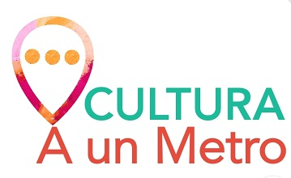

# PANORAMIX 
# Cultura a un Metro (Proyecto Red Social) 

## **Índice**

* [Presentación](#presentacion)
* [Link ](#link)
* [Modo de Uso](#modo-de-uso)
* [Historias de Usuarios](#historias-de-usuarios)
* [Sketch de Solución](#sketch-de-solucion)
* [Test de Usabilidad](#test-de-usabilidad)
* [Diseño de Interfaz](#diseno-de-interfaz)
* [Planificación del Proyecto](#planificacion-del-proyecto)
* [Consideraciones técnicas](#consideraciones-tecnicas)

***

## **Presentación**

**PANORAMIX** es una aplicación MOBILE , construida para facilitar la búsqueda y visualización de panoramas/eventos publicados en el Muro del Metro de Santiago, junto con otros eventos que puedan publicar usuarios que sean realizados cercanos a alguna estación de las diferentes líneas de la Red de Metro de Santiago  [PlanoRed](https://media.metrolatam.com/2019/01/22/20170323planometrored-50c29ddf7ea05903594d46b28280cc5f.jpg).

## **Link PANORAMIX**

Podrás visualizar esta aplicación en el siguiente link:
[Panoramix](https://patriciavaldebenito.github.io/SCL009-Social-Network/?#/)

## **Modo de Uso**

En **Panoramix** necesitas contar con un registro de usuario para acceder a la información

Tienes dos alternativas para la creación de usuario:  
1. Llenando un formulario con tus datos: nombre, correo , edad, y contraseña  
2. A través de la autentificación de Google  

